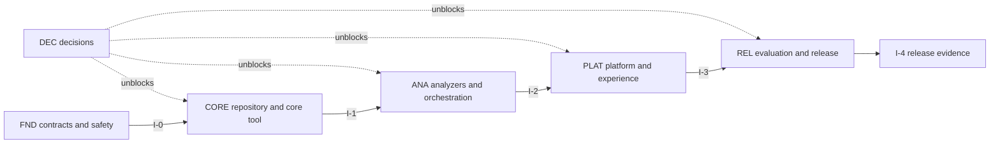

# Proposed Parallel MVP Execution Plan

**Status:** Proposed
**Last updated:** 2026-07-18

This folder translates the [requirements](../../../requirements.md),
[product specification](../../../specification/README.md),
[proposed system design](../../../design-docs/system-design.md), and
[accepted architecture decisions](../../../decisions.md) into separate,
handoff-ready delivery cohorts.

The plan does not create product scope, accept an architecture decision, or
resolve an [open product decision](../../../open-decisions.md). A gated task may
start only after the responsible decision is accepted and recorded.

## How to Use This Plan

1. The coordinator reads this file and assigns an integration owner.
2. Hand each agent only the cohort file and packet it owns, plus the exact base
   checkpoint or commit.
3. Agents implement their owned outputs without redefining another packet's
   contracts.
4. The integration owner merges packets in the order stated in the cohort file,
   runs the cohort checks, and publishes the next checkpoint.
5. Do not dispatch the next cohort until its entry condition is satisfied.

## Immediate Dispatch

The following files can be handed off now from the same repository baseline:

* [DEC — Decision preparation](00-decisions.md): two decision-preparation
  packets can run in parallel.
* [FND — Contracts and safety](01-foundation.md): FND-1 through FND-5 can run in
  parallel, followed by FND-6 contract convergence.

Do not dispatch CORE until checkpoint I-0 is published and G-02 is accepted.

## Cohort Files

| Order | Cohort file | Parallel shape | Exit checkpoint |
| --- | --- | --- | --- |
| 0 | [DEC — Decision preparation](00-decisions.md) | 2 packets; runs beside implementation | Accepted decisions unblock their dependent packets. |
| 1 | [FND — Contracts and safety](01-foundation.md) | 5 packets, then 1 convergence packet | I-0: contracts, safety fixtures, provisional evaluation harness, and settings are stable. |
| 2 | [CORE — Repository and core tool](02-core.md) | 4 immediate packets and 1 staggered packet | I-1: supported fixtures are safely mapped, validated, and rendered. |
| 3 | [ANA — Analyzers and orchestration](03-analyzers.md) | 5 packets in round A, 3 in round B, then 2 convergence packets | I-2: representative projects reach one validated application service. |
| 4 | [PLAT — Platform and experience](04-platform.md) | 3–4 packets in round A, 3 in round B, optional UI tail | I-3: selected access modes, persistence, search, refresh, and isolation are integrated. |
| 5 | [REL — Evaluation and release](05-release.md) | 1 evaluation owner plus parallel fixes by prior owners | I-4: acceptance evidence and the release report are complete. |



## Task Ownership Index

Every task has one completion owner. E-01 has a provisional foundation in FND
and E-02 has early scaffolding in PLAT, but REL owns final completion of both.

| Cohort | Owned gate or task IDs |
| --- | --- |
| DEC | G-01 through G-06 |
| FND | C-01, C-02, C-03, S-01, P-00; provisional E-01 foundation only |
| CORE | R-01 through R-04, K-01, S-02, S-03, O-01 |
| ANA | A-01 through A-06, K-02, K-03, Y-01, S-04 |
| PLAT | P-01 through P-03, S-05, U-01 through U-03; non-blocked E-02 scaffolding only |
| REL | E-01, E-02, and E-03 |

## Shared Delivery Rules

### Contract First

The canonical card schema, ontology versions, Claim and Evidence semantics,
Source Snapshot, and analyzer result interfaces are shared contracts. Only their
owning packets may change them. Downstream packets consume the published
contract checkpoint.

### Static and Untrusted by Default

Repository content is data, not instruction. No packet may import, build, or
execute an analyzed project. Source content cannot expand tool authority,
project scope, analysis policy, or output requirements.

### One Canonical Output

Direct Codex-session use, API use, generated Markdown, Card Summary, Evidence
view, disposable search state, and any selected frontend derive from the same
versioned `project-card.yaml` files.

### Work From Published Checkpoints

Agents start from the exact checkpoint supplied by the coordinator. They must
not copy unmerged interfaces from another agent's working tree. If a shared
dependency changes, the integration owner publishes a replacement checkpoint
before dependent work continues.

### Keep Decision Authority Explicit

Decision-preparation agents may present options and recommendations. They may
record a decision only after the responsible stakeholder or architecture owner
accepts it. Implementation agents stop at unresolved gates.

## Current Baseline

The following work already exists:

* A root `uv` workspace with the Python backend and seven-day dependency release
  cooldown.
* A FastAPI application factory, router layout, health endpoint, and API tests.
* A top-level `frontend/` project boundary without selected build tooling.
* Accepted React, FastAPI, Pydantic, OpenAI Agents SDK, Codex, direct-session,
  and API-adapter constraints.
* Specified card semantics, exploration workflow, safety boundaries, and MVP
  acceptance criteria.

The executable schema, ontologies, analyzers, card skill, orchestration,
YAML-backed persistence, basic search, refresh, and user-facing card flow remain
plan work.

## MVP Outcome and Boundary

Deliver the smallest end-to-end system that statically analyzes a supported
public GitHub project and produces a schema-valid, evidence-backed Agent Project
Card tied to an explicit project boundary and Source Snapshot.

The plan stays within the [MVP scope](../../../specification/06-mvp-scope-and-evaluation.md#19-mvp-scope).
It excludes private repositories, dynamic code execution, continuous
monitoring, full security scanning, advanced recommendation, automated
multi-project architecture generation, automated commercial conclusions, full
knowledge-graph implementation, and organization-wide access control.

## Critical Path

1. C-01 and C-02, followed by C-03
2. G-02 and R-01 through R-04
3. K-01 and G-06, followed by K-03
4. A-01 through A-06
5. Y-01, followed by S-04
6. P-01 in parallel with P-02 under the accepted YAML-first catalog decision
7. P-03 and S-05
8. E-02
9. G-03 and E-03

G-01 determines the release sequence and whether U-01 through U-03 join the
critical path. K-02 keeps direct-session use independently testable.

## Standard Agent Handoff

```text
You own packet <packet ID> in <cohort file>, covering tasks <task IDs>.
Start from checkpoint <checkpoint/commit>.

Implement only the packet's owned outputs and tests. Read the plan index,
requirements, specification, decisions, and design with their documented
authority. Do not answer an open decision, change a contract owned by another
packet, execute analyzed repository code, or add out-of-scope MVP behavior.

Before returning:
1. Meet the task-specific exit criteria and shared Definition of Done.
2. Run relevant locked tests and add focused fixtures.
3. Sync only from coordinator-published checkpoints.
4. Report changed files, commands and results, remaining risks, and any blocked
   decision or downstream handoff.
```

## Shared Definition of Done

A packet is complete only when all applicable conditions hold:

* Its output traces to the specification and does not silently resolve a gate.
* Public interfaces have typed failures and documented semantics and version
  behavior.
* Relevant unit, contract, fixture, integration, and adversarial tests pass.
* Static findings are not labeled runtime verified.
* Material conclusions preserve Claim, Evidence, confidence, verification,
  scope, and Source Snapshot relationships.
* `unknown`, `not_applicable`, `not_analyzed`, and `no_evidence_found` remain
  distinct.
* Repository content stays inside its declared boundary, is never executed, and
  cannot become control instruction.
* Human-readable outputs remain projections of the canonical card.
* New Python dependencies use `uv >= 0.9.17`, retain the seven-day cooldown, and
  are committed through the root lockfile.
* Documentation, fixtures, traceability, and the packet handoff report are
  updated.

## Specification Traceability

| Product behavior | Owning cohorts | Specification |
| --- | --- | --- |
| Project boundary and Source Snapshot | FND, CORE | [Sources](../../../specification/02-classification-and-sources.md#10-input-sources), [Exploration](../../../specification/03-repository-exploration-workflow.md), [Card identity](../../../specification/04-card-schema-and-outputs.md#121-identity-and-source-snapshot) |
| Classification, capabilities, and architecture | FND, CORE, ANA | [Classification](../../../specification/02-classification-and-sources.md#9-project-classification-system), [Capabilities](../../../specification/04-card-schema-and-outputs.md#125-capabilities) |
| Canonical card, Claims, Evidence, confidence, and null states | FND, CORE, ANA | [Card Schema](../../../specification/04-card-schema-and-outputs.md#12-agent-project-card-schema), [Card Generation](../../../specification/05-system-behavior-and-quality.md#card-generation) |
| Direct Codex-session and API use through one skill | CORE, ANA, PLAT | [Core Tool](../../../specification/01-product-overview.md#7-core-tool-and-use-cases), [Access](../../../specification/05-system-behavior-and-quality.md#access-and-invocation) |
| Source safety, no execution, and isolation | FND, ANA, PLAT, REL | [Source Trust](../../../specification/02-classification-and-sources.md#source-trust-and-provenance), [Security](../../../specification/05-system-behavior-and-quality.md#security) |
| Human-readable views, search, and refresh | CORE, PLAT | [Output Formats](../../../specification/04-card-schema-and-outputs.md#13-card-output-formats), [Search](../../../specification/05-system-behavior-and-quality.md#search-and-retrieval), [Refresh](../../../specification/05-system-behavior-and-quality.md#refresh-and-change-tracking) |
| Evaluation and release acceptance | FND, REL | [MVP Scope and Evaluation](../../../specification/06-mvp-scope-and-evaluation.md) |
