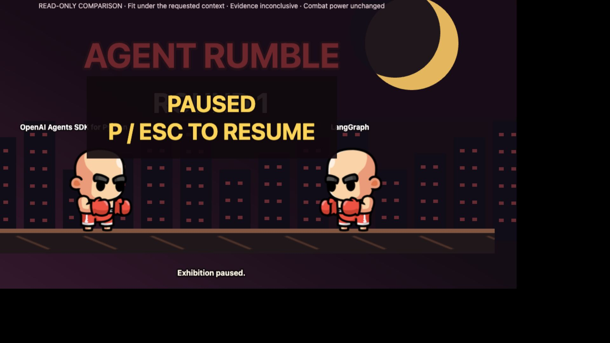

# Built-in Browser Test — 2026-09-26

The main catalog, comparison, and evidence flows worked in the Codex built-in
browser. Arcade fullscreen failed: the canvas replaced the complete cabinet,
hiding health, timer, round score, and controls. Arcade keyboard input could not
be verified through the automation interface. This run does not establish full
browser or device acceptance.

## Environment and Scope

* Build: `8ce4078a030d1b60b3a1332c8e301c04a15c6a53`; clean working tree before
  testing. Only this QA record, its links, and evidence artifacts were added.
* Date: 2026-09-26, approximately 09:49–09:57 Europe/London.
* OS: macOS 26.6.2, build 25G83. Browser: Codex in-app browser; exact browser
  version was not recorded.
* Controls: built-in browser accessibility actions, screenshots, keyboard
  input, and its Playwright locator interface. No external browser driver or
  repository-owned end-to-end suite was added.
* Viewports: default embedded browser; explicit 390 × 844, 768 × 1024, and
  1280 × 800 CSS-pixel overrides. Overrides were reset before the final
  fullscreen reproduction and before completion. Browser zoom was not changed.
* Runtime: Python 3.12.10, uv 0.11.29, Node 24.20.0, npm 11.19.0. Dependencies
  were installed from the committed lockfiles using existing local caches.
* Frontend: `http://127.0.0.1:5173`; backend: `http://127.0.0.1:8000`.
* Disposable service roots: `/private/tmp/agent-rumble-browser-qa.jJhN0G/catalog`
  and `/private/tmp/agent-rumble-browser-qa.jJhN0G/drafts`. The catalog was copied
  from the repository: 11 current projects, 14 retained versions. No drafts were
  generated or published.
* Main comparison: OpenAI Agents SDK for Python v2, source
  `65886fa16dcdb482090b30b74de1d0cc80b9f4c6`, and LangGraph v2, source
  `49ae27c2ae983cfb92091b0dea9f7bc37a716479`. CrewAI was also used to exercise
  the three-project shortlist limit. Context came from the Python example in
  the [test plan](test-plan.md#baseline-expectations).

## Executed Checks

These are bounded subcases of the [QA plan](test-plan.md), not passes for every
step in the parent cases. The denominator is the 19 checks below: **17 Pass,
1 Fail, 1 Blocked**. Automated test results are recorded separately from browser
interaction results.

| Case / executed subcase | Result | Actions and observed evidence |
| --- | --- | --- |
| UI-01 / scope and full browse | Pass | Expanded catalog scope/freshness; Browse displayed 11 distinct current project names. No Load more control was expected with this corpus. |
| UI-02 / example searches | Pass | Biomedical example returned 5 results with match explanations; Python example returned 9. These are full-context searches, not the context-free keyword baselines. |
| UI-02 / empty result | Pass | Set query and Use case to `zzzzqaxqjx`, cleared the context lists, and submitted. Saw No matching projects yet, an Uninterpreted term, and Try a broader search; Update search returned to the form. |
| UI-03 / context polarity | Pass | Added Prefer `Local persistence` and Avoid `Mandatory hosted control plane`. Results displayed distinct Must, Prefer, and Avoid labels. Network payload inspection was not performed. |
| UI-04 / shortlist limits | Pass | One selected project disabled comparison; two enabled comparison and Rumble; three disabled all other selection buttons and removed Rumble. Removing CrewAI restored the two-project actions. |
| UI-04 / reload and navigation | Pass | Reload restored OpenAI Agents SDK for Python and LangGraph; backend logs showed current-card retrieval. Comparison/back retained the pair; Explore reset the shortlist. |
| UI-05 / matching and changed context | Pass | The Python example showed claim-linked fit with Confirmed in source and Medium confidence. Adding Prefer/Avoid produced Not analyzed for both projects, with verification and confidence not recorded. |
| UI-06 / details and filtering | Pass | Highlights showed 20 rows across 7 sections. All details plus search `schema` found 9 details across 6 sections, including Schema Version `0.3` for both cards. This was a sample check, not exhaustive field-inventory validation. |
| UI-07 / claim drawer and focus | Pass | Opened OpenAI fit claim: three supporting sources, pinned revision, source kind/publisher, retrieval time, locators, excerpts, and commit-specific links. Shift+Tab from Close wrapped to the final source link; Tab wrapped to Close; Escape dismissed the drawer and restored the originating claim button. See [desktop evidence](artifacts/browser-2026-09-26/evidence-desktop.png). |
| UI-08 / outage and recovery | Pass | Stopped only this QA backend and submitted search. A visible HTTP 500 error appeared without substitute results. Restarting with the same roots and resubmitting returned 9 results. |
| UI-09 / responsive layout sample | Pass | Inspected desktop and 390-pixel comparison/evidence screenshots. Mobile values stacked with project labels; the drawer filled the viewport. Document width did not exceed viewport width at 390 or 768 pixels. See [mobile comparison](artifacts/browser-2026-09-26/comparison-mobile.png) and [mobile evidence](artifacts/browser-2026-09-26/evidence-mobile.png). Tablet inspection covered overflow only. |
| R-01 / canonical tour | Pass | Entered the pinned v2 matchup, opened the same OpenAI fit claim as comparison, advanced through all 12 rounds, and reached the contextual recap. All calls were Inconclusive; recap explicitly avoided a universal winner. Exit returned to the shortlist. |
| R-02 / solo rendering and CPU smoke | Pass | Phaser loaded, both named boxers rendered, and CPU attacks reduced player HP (79 and 24 observed). Round progression was observed. Restart reset both fighters to 100 HP and zero rounds won. No completed match or player-controlled combat is certified. |
| R-03 / local mode initialization | Pass | Local 2-player rendered both named fighters at 100 HP and displayed the separate control sets. Independent/simultaneous player movement and attacks remain unverified. |
| R-04 / cabinet controls and cleanup | Pass | Visible Pause/Resume and Restart controls worked. End match and inspect this evidence round returned to canonical evidence; exiting removed the canvas (zero remaining). Re-entry initialized a new cabinet. Memory/listener profiling was not performed. |
| R-04 / fullscreen | Fail | Reproduced loss of cabinet health/timer/score and controls both with a viewport override and at default browser sizing. See BROWSER-01 below. |
| R-02, R-03, R-04 / arcade keyboard input | Blocked | Automated `P`, Escape, special, and jump key attempts did not produce reliable observable gameplay changes, including focused-canvas locator input. Mouse controls worked. The run cannot distinguish automation key delivery from a product keyboard defect; physical-keyboard verification is required. |
| GEN-03 / invalid source URL | Pass | Submitted `https://example.com/not-github` with a nonempty test boundary. Backend returned 422; UI showed The request did not match the API contract. No source acquisition or model generation was started. |
| OPS-02 / frontend tests and build | Pass | `npm test`: 86 tests in 11 files passed. `npm run build`: TypeScript and production build passed. See [tests](artifacts/browser-2026-09-26/frontend-tests.log) and [build](artifacts/browser-2026-09-26/frontend-build.log). |

## BROWSER-01 — Fullscreen Hides Cabinet State and Controls

**Priority:** P1. **Status:** Open. **Affected case:** R-04.

Reproduction:

1. Browse, select OpenAI Agents SDK for Python and LangGraph, and enter Rumble.
2. Enter solo fight and wait until cabinet controls are enabled.
3. Pause using the visible button, then select Enter fullscreen.

Observed: fullscreen exposes only the canvas. The DOM-based health bars, timer,
round score, pause/restart/fullscreen/exit buttons, and evidence controls are
absent from the visible view. Accessibility inspection reports only an image.
The failure repeats at normal browser sizing, so it is not limited to the
responsive viewport override. Automated Escape did not recover the cabinet;
reloading recovered the application. Physical Escape behavior is unverified.

Expected: gameplay state and a usable exit remain reachable in fullscreen,
as required by [R-04](test-plan.md#r-04--pause-restart-fullscreen-touch-and-cleanup).

Likely implementation cause, based on static inspection:
[`runtime.ts`](../../frontend/src/arcade/runtime.ts) calls Phaser's
`game.scale.startFullscreen()` without a cabinet fullscreen target, while
[`ArcadeGame.tsx`](../../frontend/src/arcade/ArcadeGame.tsx) renders the health
display and controls outside the canvas host. No implementation fix was made.

## Limits and Follow-up

* Full keyboard-only navigation, physical arcade controls, simultaneous keys,
  real touch/coarse-pointer input, 200% zoom, reduced motion, focus-loss pause,
  and cross-browser testing remain open.
* No live-provider generation, draft retrieval/refresh/download, publication,
  throttled late-response scenarios, canonical-Rumble outage/retry, expanded
  pagination corpus, or full recursive field audit was run in this browser pass.
* No browser console warnings/errors were reported in the pre-fault arcade
  sample. This does not certify all network requests or later deliberate failures.
* The build still warns about the lazy Phaser runtime chunk: 1,228.27 kB
  minified, 338.81 kB gzip. Arcade loading was observed but not benchmarked.
* [GAP-03](README.md#remaining-gaps-and-review-findings) remains open. Resolve
  BROWSER-01, establish physical-keyboard behavior, and execute the remaining
  device/provider cases before claiming browser acceptance.

The frontend and disposable backend were left running for inspection. The
built-in browser was returned to Explore with the Python example selected and
its temporary viewport override cleared.
